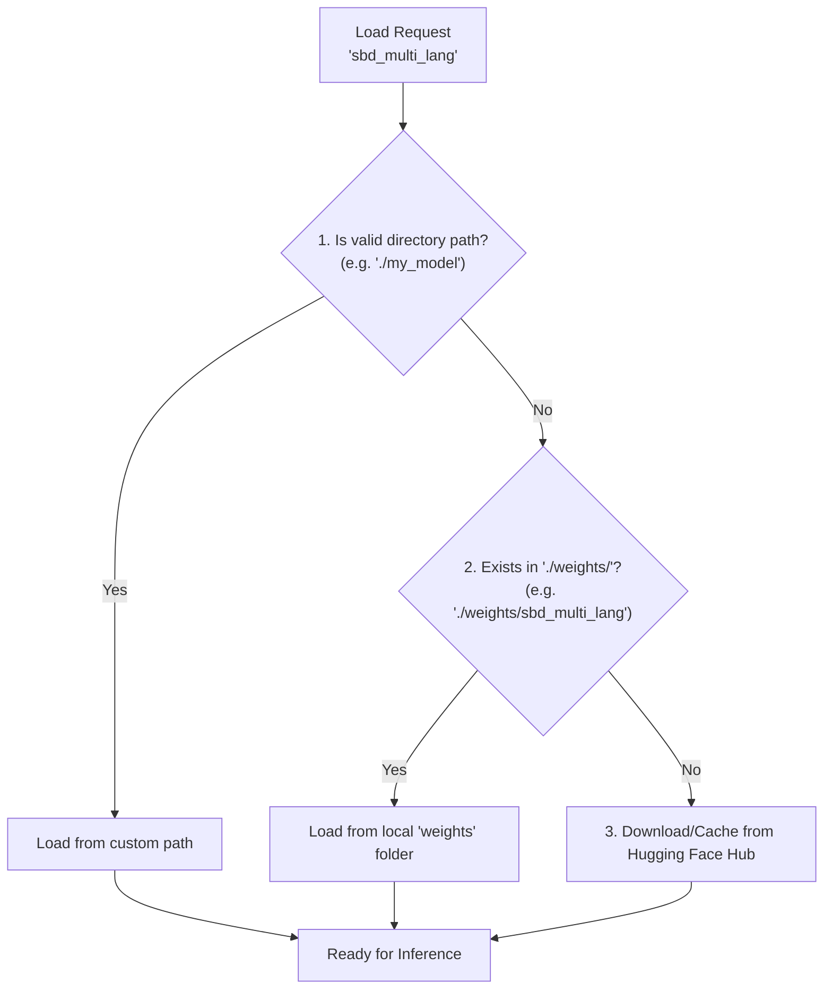

# Model Loading & Offline Usage Guide

The `punctuators` library employs a **Local-First** strategy for loading models. This facilitates usage in offline environments or with custom fine-tuned weights.

## Loading Process (Flowchart)

When `from_pretrained("model_name")` is called, the library follows this logic:



## Priority Details

1.  **Direct Path**
    *   If the provided name is a valid directory path, it is used immediately.
    *   Example: `SBDModelONNX.from_pretrained("./custom_models/v1")`

2.  **Local Weights Folder (Auto-Discovery)**
    *   Checks if a folder with the model name exists inside the `./weights/` directory of the current working path.
    *   Example: Calling `from_pretrained("sbd_multi_lang")` -> Checks `./weights/sbd_multi_lang/`.
    *   **Recommended**: Run the `download_models.py` script to populate this folder.

3.  **Hugging Face Hub (Fallback)**
    *   If no local files are found, the model is automatically downloaded/cached from the Hugging Face Hub.
    *   **Note**: Large models (like PCS) are not included in the Git repo due to size limits. You must rely on this fallback (requires internet) or use `download_models.py`.

## Using the Download Script

Due to Git file size limits, large models (PCS) are excluded from the repository. You can download all necessary models to your local `weights/` directory using the provided script:

```bash
python download_models.py
```

This script will:
1.  Fetch the latest model files (`model.onnx`, `sp.model`, `config.yaml`) from Hugging Face.
2.  Save them into the appropriate subdirectories under `weights/`.
3.  Subsequent executions will automatically use these local files without needing an internet connection.
