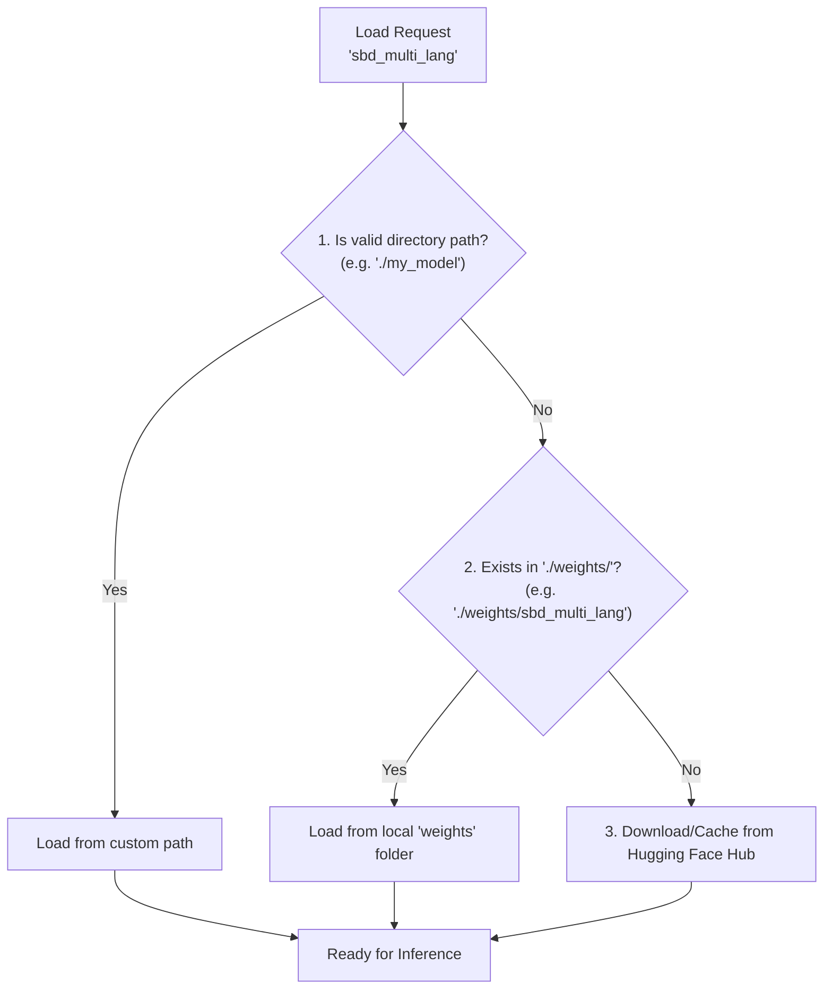

# 모델 로딩 및 오프라인 사용 가이드

`punctuators` 라이브러리는 **로컬 파일 우선(Local-First)** 정책을 사용하여 모델을 로드합니다. 이를 통해 인터넷 연결이 없는 오프라인 환경이나, 사용자가 직접 수정한 모델(Fine-tuned)을 쉽게 사용할 수 있습니다.

## 모델 로딩 프로세스 (순서도)

라이브러리가 `from_pretrained("model_name")`을 호출할 때의 동작 방식은 다음과 같습니다:



## 우선순위 상세 설명

1.  **직접 경로 지정 (Direct Path)**
    *   함수에 전달된 이름이 실제 존재하는 디렉토리 경로인 경우, 무조건 해당 경로의 파일을 사용합니다.
    *   예: `SBDModelONNX.from_pretrained("./custom_models/v1")`

2.  **자동 로컬 검색 (Local Weights Folder)**
    *   현재 작업 디렉토리의 `weights/` 폴더 내에 해당 모델 이름과 동일한 폴더가 있는지 확인합니다.
    *   예: `from_pretrained("sbd_multi_lang")` 호출 시 -> `./weights/sbd_multi_lang/` 확인.
    *   **권장 사용법**: `download_models.py` 스크립트를 실행하면 이 위치에 모델이 자동 저장됩니다.

3.  **Hugging Face Hub (Fallback)**
    *   위 로컬 경로에 파일이 없으면, 자동으로 Hugging Face Hub에서 모델을 다운로드(캐시)하여 사용합니다.
    *   **주의**: 일부 대용량 모델(PCS 등)은 Git 저장소에 포함되어 있지 않으므로, 최초 1회 인터넷 연결이 필요하거나 `download_models.py`를 사용해야 합니다.

## 모델 다운로드 스크립트 사용법

Git 저장소 용량 문제로 인해 대용량 모델(PCS)은 기본적으로 포함되어 있지 않습니다. 다음 스크립트를 실행하여 필요한 모든 모델을 로컬(`weights/`)로 다운로드할 수 있습니다.

```bash
python download_models.py
```

이 스크립트를 실행하면:
1.  Hugging Face에서 최신 모델 파일(`model.onnx`, `sp.model`, `config.yaml`)을 가져옵니다.
2.  `weights/` 폴더 아래 각 모델별 디렉토리에 저장합니다.
3.  이후 실행부터는 인터넷 연결 없이 이 로컬 파일들이 자동으로 사용됩니다.
