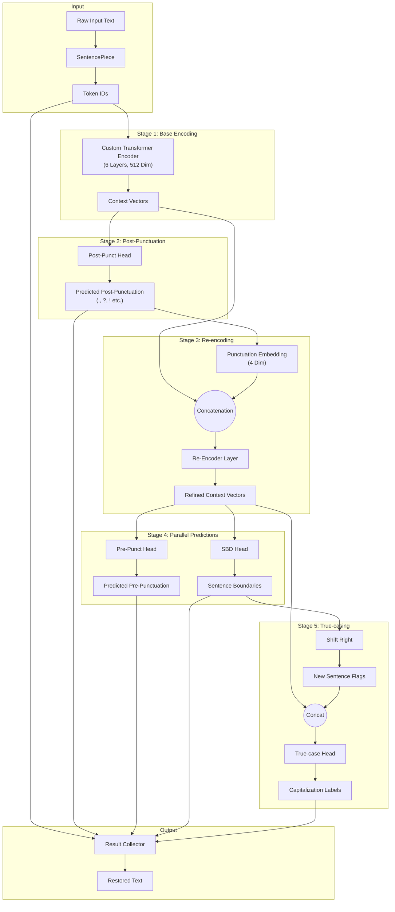

# PCS Lightweight (Punctuation, Capitalization, Segmentation) Model Specs

## 1. Overview
*   **Model ID**: `1-800-BAD-CODE/punct_cap_seg_47_language`
*   **Purpose**: Restore punctuation, capitalization, and segments from raw text (e.g., ASR output).
*   **Languages**: 47 languages.
*   **Type**: Lightweight, speed-optimized model.

## 2. Architecture Details
The model employs a custom transformer architecture dependent on a sequential refinement pipeline, rather than a standard single-pass BERT.

### 2.1 Base Components
1.  **Tokenizer**: SentencePiece (64k Vocab).
2.  **Encoder**: 6-layer Transformer (Model dim 512). Half the depth of BERT-Base.

### 2.2 Multi-Stage Dependency Pipeline
The core innovation is breaking the task into conditional stages:

1.  **Encoding**: Initial embedding of the raw input text.

2.  **Post-punctuation**:
    *   Predicts punctuation marks that appear *after* a token (period, comma, question mark).
    *   Prediction is made per subword.

3.  **Re-encoding (Critical Step)**:
    *   The predicted post-punctuation is embedded (4-dim vector).
    *   This embedding is concatenated with the original encoder output.
    *   The combined vector is **re-encoded** to update the global context. Now the model "knows" where the periods and commas are.

4.  **Pre-punctuation & SBD**:
    *   **Pre-punctuation**: Predicts marks *before* a token (e.g., Spanish inverted `¿`). Conditioned on the re-encoded context (e.g., only predict `¿` if a `?` was predicted later).
    *   **SBD**: Predicts sentence boundaries. Since it knows where the periods are (from Step 3), accuracy is high.

5.  **True-casing**:
    *   The SBD decision is shifted right by one token.
    *   If Token `T` was an SBD boundary, Token `T+1` is marked as "Start of Sentence".
    *   The True-casing head uses this flag to correctly capitalize the first word of the new sentence.

### 2.3 Mermaid Diagram

## 3. Training Details
*   **Source**: WMT News Crawl corpus.
*   **Volume**: ~1 Million lines per language.
*   **Domain**: News text (Formal). May perform ideally on conversational data but robustness varies.

## 4. Limitations
1.  **Acronym Handling**:
    *   The model predicts only *one* post-punctuation mark per subword.
    *   Complex acronyms like "U.S." might be difficult if tokenized as a single unit. It assumes ASR input usually spaces them out ("u s").
2.  **Sequence Length**:
    *   Max sequence length is **128 tokens**.
    *   The `punctuators` library mitigates this by using overlapping sliding windows for inference.
3.  **Production Readiness**:
    *   Trained on a relatively small dataset (1M lines/lang) compared to modern LLMs. Expect "prototype" level performance rather than GPT-4 level perfection.
