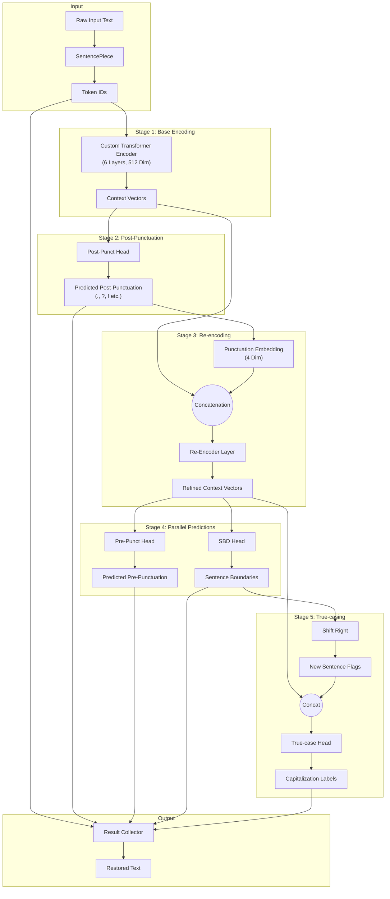

# PCS Lightweight (Punctuation, Capitalization, Segmentation) 모델 상세 명세서

## 1. 모델 개요
*   **모델 ID**: `1-800-BAD-CODE/punct_cap_seg_47_language`
*   **목적**: 구두점이 없는 원시 텍스트(예: ASR 음성 인식 결과)를 입력받아 구두점 복원, 대소문자 복원, 문장 분리를 수행합니다.
*   **지원 언어**: 47개 언어
*   **특징**: 빠른 추론 속도를 위해 설계된 경량화 모델입니다.

## 2. 모델 아키텍처 (Architecture Details)
이 모델은 일반적인 BERT 모델이 아니라, 추론 속도 최적화를 위해 특별히 설계된 **Custom Transformer** 구조를 가집니다.

### 2.1 기본 인코더 (Base Encoder)
1.  **Tokenizer**: SentencePiece (64k Vocab)
2.  **Layers**: 6 Transformer Layers (일반적인 BERT-Base의 절반 수준)
3.  **Model Dimension**: 512

### 2.2 다단계 예측 파이프라인 (Multi-Stage Pipeline)
이 모델은 모든 작업을 한 번에 수행하지 않고, 의존성(Dependency)을 가진 순차적 단계로 처리하여 성능을 높입니다.

1.  **Encoding (인코딩)**:
    *   입력 텍스트를 토큰화하고 인코딩합니다.

2.  **Post-punctuation (후방 구두점 예측)**:
    *   먼저 각 토큰 **뒤**에 올 구두점(콤마, 마침표, 물음표 등)을 예측합니다.
    *   예: "hello" -> "hello," 또는 "hello."

3.  **Re-encoding (재인코딩 - 핵심 기술)**:
    *   앞서 예측한 구두점 정보를 4차원 임베딩으로 변환합니다.
    *   이를 원래의 인코딩 벡터와 결합(Concatenation)하고 다시 한번 인코딩(Re-encode)합니다.
    *   **효과**: 모델이 "구두점이 이미 복원된 상태"라고 가정하고 문맥을 다시 파악할 수 있게 해줍니다.

4.  **Pre-punctuation & SBD (전방 구두점 및 문장 분리)**:
    *   **Pre-punctuation**: 재인코딩된 정보를 바탕으로 토큰 **앞**의 구두점(스페인어 `¿` 등)을 예측합니다. 조건부 예측이므로 `?`가 뒤에 올 때만 `¿`를 예측하도록 유도됩니다.
    *   **SBD**: 문장 경계를 예측합니다. "마침표가 예측된 위치" 정보를 이미 알고 있으므로 훨씬 정확하게 문장을 끊을 수 있습니다.

5.  **True-casing (대소문자 복원)**:
    *   SBD 예측 결과(문장 경계)를 오른쪽으로 한 칸 이동(Shift)시켜, "문장의 첫 단어" 정보를 True-casing 헤드에 전달합니다.
    *   이를 통해 문장의 첫 글자를 정확하게 대문자로 변환할 수 있습니다.

### 2.3 Mermaid 다이어그램 (Pipeline Diagram)

## 3. 학습 및 데이터 (Training Details)
*   **데이터 출처**: WMT News Crawl (뉴스 데이터).
*   **데이터 양**: 각 언어당 약 100만 줄(1M lines).
*   **한계**: 뉴스 데이터로만 학습되었기 때문에 대화체나 매우 비공식적인 텍스트에서는 성능이 떨어질 수 있습니다.

## 4. 제약 사항 (Limitations)
1.  **약어(Acronym) 처리 한계**:
    *   구두점 예측이 "서브워드당 1회"만 수행됩니다.
    *   따라서 "U.S."와 같이 한 단어 내에 여러 구두점이 있는 경우를 완벽히 처리하지 못할 수 있습니다. (예: 'U.S.' 대신 'US'로 처리되거나 'U. S.'로 분리됨)
    *   다만 ASR 결과는 보통 'u s' 처럼 띄어쓰기로 들어오므로 큰 문제는 아닙니다.
2.  **최대 길이 제한**:
    *   Max Sequence Length가 **128**로 비교적 짧습니다. 긴 문단을 처리할 때는 윈도우 슬라이딩(Window Sliding) 기법이 필수적입니다. (이 라이브러리는 자동으로 처리해줍니다.)
3.  **생산 품질**:
    *   100만 줄의 데이터는 대규모 언어 모델 기준으로는 적은 편입니다. 완벽한 상용 수준의 품질을 보장하지는 않습니다.
