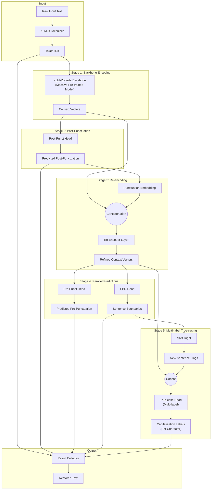

# PCS XLM-Roberta (High Accuracy) Model Specs

## 1. Overview
*   **Model ID**: `1-800-BAD-CODE/xlm-roberta_punctuation_fullstop_truecase`
*   **Purpose**: High-fidelity restoration of punctuation, casing, and segmentation.
*   **Backbone**: **XLM-Roberta** (State-of-the-art multilingual model by Facebook AI).

## 2. Architecture Details
While utilizing the same logical prediction graph as the lightweight model, this model replaces the custom encoder with the massive XLM-Roberta backbone.

### 2.1 Backbone Encoder
*   **XLM-Roberta**: Trained on 2.5TB of CommonCrawl data in 100 languages.
*   Provides superior understanding of semantics and syntax, allowing correct punctuation even in ambiguous contexts (e.g., specific acronyms vs end of sentence).

### 2.2 Prediction Graph Logic
1.  **Tokenizer**: XLM-R Tokenizer (Vocab ~250k).
2.  **Encoding**: Deep contextual embedding via XLM-R.
3.  **Graph Flow**:
    *   **Punctuation Head**: Predicts marks before/after subwords.
    *   **Conditioning**: Predicted punctuation is embedded and fed into the SBD head.
    *   **Shifted SBD**: SBD output is shifted to inform the True-casing head.

### 2.3 Advanced True-casing
*   Modeled as a **Multi-label problem**.
*   The model makes `N` predictions per subword, where `N` is the number of characters in that subword.
*   **Benefit**: This allows arbitrary capitalization patterns like "NATO" (all caps), "MacDonald" (internal caps), or "mRNA" (first letter lowercase). This is more advanced than the simple "Capitalize First Letter" approach.

### 2.4 Mermaid Diagram

## 3. Training Details
*   **Hardware**: Trained on NVIDIA A100 (~7 hours).
*   **Data**: One million lines per language from WMT News Crawl.
*   **Sampling**: Rare tokens like the Spanish inverted question mark (`¿`) were over-sampled to ensure the model learned them despite their scarcity in the general corpus.

## 4. Limitations & Known Issues
1.  **Spanish `¿` Over-prediction**:
    *   Due to the aggressive over-sampling of Spanish questions, the model tends to hallucinate inverted question marks even where they don't belong (an "over-correction").
2.  **Comma Over-prediction**:
    *   The model may be too aggressive with commas.
3.  **Resource Heavy**:
    *   Requires significantly more RAM and CPU/GPU power. Inference on CPU will be noticeably slower (seconds vs milliseconds).
4.  **News Domain Bias**:
    *   Trained on formal news text; might struggle with slang, emojis, or very informal chat logs.
