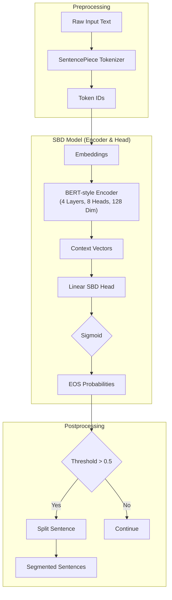

# SBD (Sentence Boundary Detection) Model Specs

## 1. Model Overview
*   **Model ID**: `1-800-BAD-CODE/sentence_boundary_detection_multilang`
*   **Purpose**: Segments long, already-punctuated text into separate sentences.
*   **Supported Languages**: 49 languages.
*   **Language Agnostic**: No language tags required during inference; mixed-language batches are supported.

## 2. Model Architecture Details
The model uses a data-driven approach built on a highly optimized **BERT-style encoder**, making it extremely fast on CPUs.

### 2.1 Components
1.  **Tokenizer**
    *   **Type**: SentencePiece
    *   **Vocabulary Size**: 64,000 tokens

2.  **Encoder**
    *   **Style**: BERT-style Transformer Encoder
    *   **Layers**: 4
    *   **Attention Heads**: 8
    *   **Hidden Dimension**: 128
    *   **Intermediate (FF) Dimension**: 512
    *   **Total Parameters**: ~9 Million
        *   Embeddings: ~8.2M (Large vocab)
        *   Compute Parameters: ~0.8M (Very lightweight compute)

3.  **Classification Head**
    *   A linear layer predicts the probability of a token being the End-Of-Sentence (EOS).

### 2.2 Mermaid Diagram

## 3. Training Details
*   **Framework**: NVIDIA NeMo (Custom fork)
*   **Data**: ~1 Million lines of text per language (Total ~49M lines).
*   **Batching**: Multilingual batches generated by random sampling of languages.
*   **Global Batch Size**: 256.

## 4. Logic & Features
*   **Abbreviation Handling**: Learned to ignore periods in acronyms like "U.S.", "Dr.", "p.m.", preventing false splits.
*   **Multilingual Punctuation**: Handles various script boundaries:
    *   Latin: `.`, `?`, `!`
    *   CJK: `。`, `？`, `！`
*   **Example**:
    *   Input: "see you at 5 p.m. don't be late."
    *   Result: Split correctly after "p.m.", but not at the first dot.

## 5. Limitations
*   **Dependency on Punctuation**: The model relies entirely on syntactic cues (punctuation). If input text lacks punctuation (e.g., raw ASR output "hello world"), the model will likely fail to split it. Use the PCS model for such cases.
*   **Data Noise**: Since it was trained on web/news data, it might struggle with highly informal or noisy text structures.
